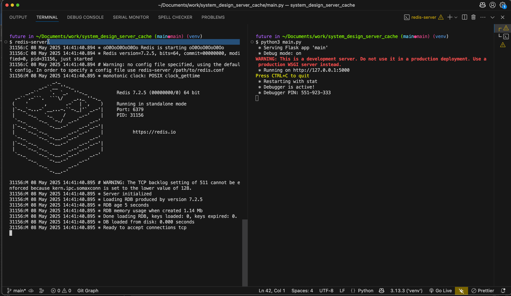

# Introduction

Create a server side cache for responding to requests.

Instead of querying our DB on every request, and potentially overloading the DB, check a cache for that data

## Dependencies

- [Flask](https://flask.palletsprojects.com/en/stable)
- [Redis](https://redis.io/docs/latest)

## Setup

- `git clone`
- `python3 -m venv venv`
- `source venv/bin/activate`
- `python3 main.py`
